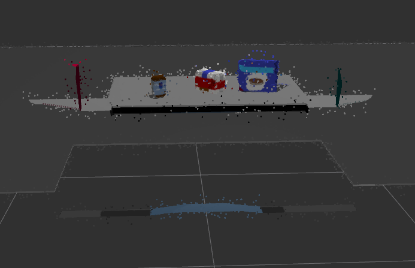

## Project: Perception Pick & Place
---
This project focuses on detecting and classiying objects on a table in front of the robot using RGB-D camera.

# Required Steps for a Passing Submission:
1. Extract features and train an SVM model on new objects (see `pick_list_*.yaml` in `/pr2_robot/config/` for the list of models you'll be trying to identify). 
2. Write a ROS node and subscribe to `/pr2/world/points` topic. This topic contains noisy point cloud data that you must work with.
3. Use filtering and RANSAC plane fitting to isolate the objects of interest from the rest of the scene.
4. Apply Euclidean clustering to create separate clusters for individual items.
5. Perform object recognition on these objects and assign them labels (markers in RViz).
6. Calculate the centroid (average in x, y and z) of the set of points belonging to that each object.
7. Create ROS messages containing the details of each object (name, pick_pose, etc.) and write these messages out to `.yaml` files, one for each of the 3 scenarios (`test1-3.world` in `/pr2_robot/worlds/`).  [See the example `output.yaml` for details on what the output should look like.](https://github.com/udacity/RoboND-Perception-Project/blob/master/pr2_robot/config/output.yaml)  
8. Submit a link to your GitHub repo for the project or the Python code for your perception pipeline and your output `.yaml` files (3 `.yaml` files, one for each test world).  You must have correctly identified 100% of objects from `pick_list_1.yaml` for `test1.world`, 80% of items from `pick_list_2.yaml` for `test2.world` and 75% of items from `pick_list_3.yaml` in `test3.world`.
9. Congratulations!  Your Done!

More steps on running the project can be found [here](./Project_Setup.md). The main python file for this project can be found [here](./pr2_robot/scripts/project_run.py).

## [Rubric](https://review.udacity.com/#!/rubrics/1067/view) Points
### Here I will consider the rubric points individually and describe how I addressed each point in my implementation.  

---
### Writeup

#### 1. Provide a Writeup / README that includes all the rubric points and how you addressed each one.  You can submit your writeup as markdown or pdf.  
[This](README.md) is the writeup of this project.

### Exercise 1, 2 and 3 pipeline implemented
#### 1. Complete Exercise 1 steps. Pipeline for filtering and RANSAC plane fitting implemented.
The input to the perception pipeline is obtained from the `/pr2/world/points` topic. This topic contains the noisy point cloud obtained from the RGB-D camera placed on the PR2 robot.



The first step in solving this project is to filter out all other points and obtain only the point cloud of the objects in the scene.
The various steps to achieve this is listed out below:
- Statistical Outlier Filtering
This step involves removing the noise as much as possible from the environment. This filter looks in the neighborhoo and removes points that does not meet a certain criteria.
    ```py
    # creating a statistical outlier filter object for reducing noise
    outlier_filter = cloud.make_statistical_outlier_filter()
    
    # Set the number of neighboring points to analyze for any given point
    outlier_filter.set_mean_k(10)
    
    # Set threshold scale factor
    x = 0.5
    
    # Any point with a mean distance larger than global (mean distance+x*std_dev) will be considered outlier
    outlier_filter.set_std_dev_mul_thresh(x)
    
    # Finally call the filter function
    cloud_filtered = outlier_filter.filter()
    ```
    After executing the above code, we get an output as below.
    

- Voxel Grid Downsampling
Processing large point clouds requires high computations. Inorder to solve this issue, the point cloud is downsampled retaining all the important informations.
    ```py
    # Create a VoxelGrid filter object for our input point cloud
    vox = cloud_filtered.make_voxel_grid_filter()

    # Choose a voxel (also known as leaf) size
    LEAF_SIZE = 0.01   

    # Set the voxel (or leaf) size  
    vox.set_leaf_size(LEAF_SIZE, LEAF_SIZE, LEAF_SIZE)

    # Call the filter function to obtain the resultant downsampled point cloud
    cloud_filtered = vox.filter()
    ```
    The following image shows the output of voxel grid downsampling.
    
    
- Pass Through Filter
The resultant point cloud contains many objects - such as the table, table stand, side boxes along with the objects that are to be picked. A pass through filter is used to slice the scene, so that only the objects of interest are present in the scene. The below code was used to slice the scene in Z axis and Y axis.

    ```py
    # Create a PassThrough filter object for removing outliers in z direction
    passthrough = cloud_filtered.make_passthrough_filter()

    # Assign axis and range to the passthrough filter object.
    filter_axis = 'z'
    passthrough.set_filter_field_name(filter_axis)
    axis_min = 0.6
    axis_max = 1.1
    passthrough.set_filter_limits(axis_min, axis_max)

    # Finally use the filter function to obtain the resultant point cloud. 
    cloud_filtered = passthrough.filter()

    #PassThrough Filter for removing outliers in y direction
    # Create a PassThrough filter object.
    passthrough = cloud_filtered.make_passthrough_filter()

    # Assign axis and range to the passthrough filter object.
    filter_axis = 'y'
    passthrough.set_filter_field_name(filter_axis)
    axis_min = -0.4
    axis_max = 0.4
    passthrough.set_filter_limits(axis_min, axis_max)

    # Finally use the filter function to obtain the resultant point cloud. 
    cloud_filtered = passthrough.filter()
    ```
    
    The below image shows the outputt of this step.
    
    
- RANSAC plane segmentation
The output after the previous step contained the plane table surface along with the objects of interest. Since, we have the model of the table surface plane, we can easily retrieve this area using RANSAC plane segmentation. Once this is obtained, we can retrieve the object points which are just the points other than the table top points.

    ```py
    # Create the segmentation object
    seg = cloud_filtered.make_segmenter()

    # Set the model you wish to fit 
    seg.set_model_type(pcl.SACMODEL_PLANE)
    seg.set_method_type(pcl.SAC_RANSAC)

    # Max distance for a point to be considered fitting the model
    # Experiment with different values for max_distance 
    # for segmenting the table
    max_distance = 0.03
    seg.set_distance_threshold(max_distance)

    # Call the segment function to obtain set of inlier indices and model coefficients
    inliers, coefficients = seg.segment()

    # TODO: Extract inliers and outliers
    cloud_table = cloud_filtered.extract(inliers, negative=False)
    cloud_objects = cloud_filtered.extract(inliers, negative=True)
    ```
    
    The following images shows the table and the objects seperated out.
    
    
    
#### 2. Complete Exercise 2 steps: Pipeline including clustering for segmentation implemented.  
Now, we have the point cloud with objects alone in the scene. The next step involves seperating each objects out so that they can be individually passed to the object recognition pipeline. 

Euclidiean clustering is used for this purpose. This step seperates the point cloud into different clusters, ie, different objects. This is done based on the distance between the different points and grouping them together.
```py
white_cloud = XYZRGB_to_XYZ(cloud_objects)
tree = white_cloud.make_kdtree()

# Create a cluster extraction object
ec = white_cloud.make_EuclideanClusterExtraction()
# Set tolerances for distance threshold 
# as well as minimum and maximum cluster size (in points)
ec.set_ClusterTolerance(0.05)
ec.set_MinClusterSize(10)
ec.set_MaxClusterSize(25000)
# Search the k-d tree for clusters
ec.set_SearchMethod(tree)
# Extract indices for each of the discovered clusters
cluster_indices = ec.Extract()
```
These different clusters are colored differently for visualising puposes.
```py
#Assign a color corresponding to each segmented object in scene
cluster_color = get_color_list(len(cluster_indices))

color_cluster_point_list = []

for j, indices in enumerate(cluster_indices):
    for i, indice in enumerate(indices):
        color_cluster_point_list.append([white_cloud[indice][0],
                                        white_cloud[indice][1],
                                        white_cloud[indice][2],
                                        rgb_to_float(cluster_color[j])])

#Create new cloud containing all clusters, each with unique color
cluster_cloud = pcl.PointCloud_PointXYZRGB()
cluster_cloud.from_list(color_cluster_point_list)
```

The following image shows the clustered point cloud.


#### 3. Complete Exercise 3 Steps.  Features extracted and SVM trained.  Object recognition implemented.
Now, we have the segmented point cloud. The next task is to recognize which is which. This requires a model for object recognition. Since, each of the objects have unique shape and sizes, a simple machine learning algorithm such as Support Vector Machine(SVM) could be used.

First step in object recognition using machine learning involves training a model. For the purpose of data collection for training, [capture_features.py](./sensor_stick/scripts/capture_features.py) is provided. Here, we can mention the list of items and number of samples of each and the program spawns each item in the mentioned number of random orientations and collects their features.

The features collected are the color and normal of the objects. These are defined in the [features.py](./sensor_stick/src/sensor_stick/features.py) file. The `compute_color_histograms()` function takes in the cloud, converts it into HSV if required, calculates the histogram in each channel and concatenates them to form a feature. The `compute_normal_histograms()` function does the same with normals in the point cloud.

The training of the SVM is performed using [train_svm.py](./sensor_stick/scripts/train_svm.py) file. The SVM classfier is defined in Line 64-66 in this file.

Various combinations of parameters were experimented and some of the models are available [here](./P2_svm_models). The best result was obtained by taking 10 random orienataion features with HSV color histograms. A linear SVM kernel was used to train the model and an accuracy of 96.25% was obtained. The confusion matrix after training is shown below.


This trained model was then saved as [`model.sav`](model.sav) file and was loaded in the `project_run.py`(./pr2_robot/scripts/project_run.py) file.
```py
model = pickle.load(open('model.sav', 'rb'))
clf = model['classifier']
encoder = LabelEncoder()
encoder.classes_ = model['classes']
scaler = model['scaler']
```

Once the point cloud is segmented, each cluster was taken, features were calculated and the model was called to find which object it was.

```py
# Classify the clusters! (loop through each detected cluster one at a time)
detected_objects_labels = []
detected_objects = []
for index, pts_list in enumerate(cluster_indices):

# Grab the points for the cluster
pcl_cluster = cloud_objects.extract(pts_list)

 # convert pcl to ros
ros_cluster = pcl_to_ros(pcl_cluster)

# Compute the associated feature vector
chists = compute_color_histograms(ros_cluster, using_hsv=True)
normals = get_normals(ros_cluster)
nhists = compute_normal_histograms(normals)
feature = np.concatenate((chists, nhists))

# Make the prediction
prediction = clf.predict(scaler.transform(feature.reshape(1,-1)))
label = encoder.inverse_transform(prediction)[0]
detected_objects_labels.append(label)

# Publish a label into RViz
label_pos = list(white_cloud[pts_list[0]])
label_pos[2] += .4
object_markers_pub.publish(make_label(label,label_pos, index))

# Add the detected object to the list of detected objects.
do = DetectedObject()
do.label = label
do.cloud = ros_cluster
detected_objects.append(do)
```

The output was published as markers. The output is discussed in the next section.

### Pick and Place Setup

#### 1. For all three tabletop setups (`test*.world`), perform object recognition, then read in respective pick list (`pick_list_*.yaml`). Next construct the messages that would comprise a valid `PickPlace` request output them to `.yaml` format.

The perception pipeline was run in the three tabletop setups and the output `PickPlace` request was stored in to `.yaml` format. The files - [output_1.yaml](./pr2_robot/config/output_1.yaml), [output_2.yaml](./pr2_robot/config/output_2.yaml) and [output_3.yaml](./pr2_robot/config/output_3.yaml) are present in the [config](./pr2_robot/config/) folder in the pr2_robot package.

The output for each of the scenes is shown below.


As seen from the above image, all the objects across the tabletop scenes were identified accurately.

