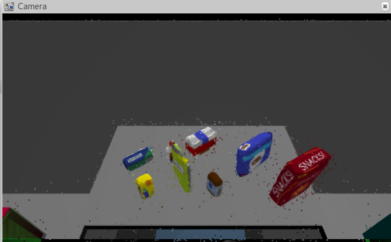
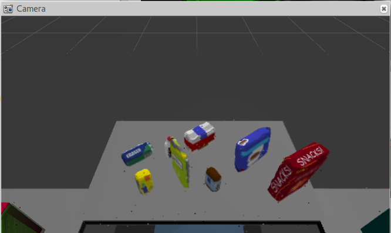

## Project: Perception Pick & Place
---
This project focuses on detecting and classiying objects on a table in front of the robot using RGB-D camera.

# Required Steps for a Passing Submission:
1. Extract features and train an SVM model on new objects (see `pick_list_*.yaml` in `/pr2_robot/config/` for the list of models you'll be trying to identify). 
2. Write a ROS node and subscribe to `/pr2/world/points` topic. This topic contains noisy point cloud data that you must work with.
3. Use filtering and RANSAC plane fitting to isolate the objects of interest from the rest of the scene.
4. Apply Euclidean clustering to create separate clusters for individual items.
5. Perform object recognition on these objects and assign them labels (markers in RViz).
6. Calculate the centroid (average in x, y and z) of the set of points belonging to that each object.
7. Create ROS messages containing the details of each object (name, pick_pose, etc.) and write these messages out to `.yaml` files, one for each of the 3 scenarios (`test1-3.world` in `/pr2_robot/worlds/`).  [See the example `output.yaml` for details on what the output should look like.](https://github.com/udacity/RoboND-Perception-Project/blob/master/pr2_robot/config/output.yaml)  
8. Submit a link to your GitHub repo for the project or the Python code for your perception pipeline and your output `.yaml` files (3 `.yaml` files, one for each test world).  You must have correctly identified 100% of objects from `pick_list_1.yaml` for `test1.world`, 80% of items from `pick_list_2.yaml` for `test2.world` and 75% of items from `pick_list_3.yaml` in `test3.world`.
9. Congratulations!  Your Done!

More steps on running the project can be found [here](Project_setup.md).

## [Rubric](https://review.udacity.com/#!/rubrics/1067/view) Points
### Here I will consider the rubric points individually and describe how I addressed each point in my implementation.  

---
### Writeup

#### 1. Provide a Writeup / README that includes all the rubric points and how you addressed each one.  You can submit your writeup as markdown or pdf.  
[This](README.md) is the writeup of this project.

### Exercise 1, 2 and 3 pipeline implemented
#### 1. Complete Exercise 1 steps. Pipeline for filtering and RANSAC plane fitting implemented.
The input to the perception pipeline is obtained from the `/pr2/world/points` topic. This topic contains the noisy point cloud obtained from the RGB-D camera placed on the PR2 robot.

The first step in solving this project is to filter out all other points and obtain only the point cloud of the objects in the scene.
The various steps to achieve this is listed out below:
- Statistical Outlier Filtering
This step involves removing the noise as much as possible from the environment. This filter looks in the neighborhoo and removes points that does not meet a certain criteria.
```py
# creating a statistical outlier filter object for reducing noise
outlier_filter = cloud.make_statistical_outlier_filter()

# Set the number of neighboring points to analyze for any given point
outlier_filter.set_mean_k(10)

# Set threshold scale factor
x = 0.5

# Any point with a mean distance larger than global (mean distance+x*std_dev) will be considered outlier
outlier_filter.set_std_dev_mul_thresh(x)

# Finally call the filter function
cloud_filtered = outlier_filter.filter()
```
After executing the above code, we get an output as below.


#### 2. Complete Exercise 2 steps: Pipeline including clustering for segmentation implemented.  

#### 2. Complete Exercise 3 Steps.  Features extracted and SVM trained.  Object recognition implemented.
Here is an example of how to include an image in your writeup.


### Pick and Place Setup

#### 1. For all three tabletop setups (`test*.world`), perform object recognition, then read in respective pick list (`pick_list_*.yaml`). Next construct the messages that would comprise a valid `PickPlace` request output them to `.yaml` format.

And here's another image! 


Spend some time at the end to discuss your code, what techniques you used, what worked and why, where the implementation might fail and how you might improve it if you were going to pursue this project further.  


